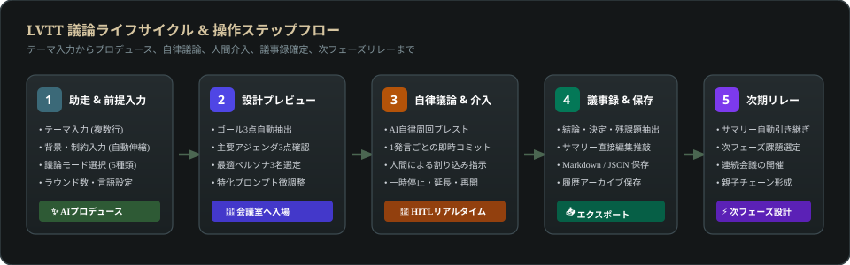
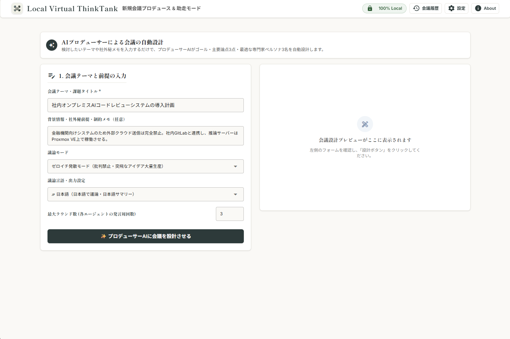
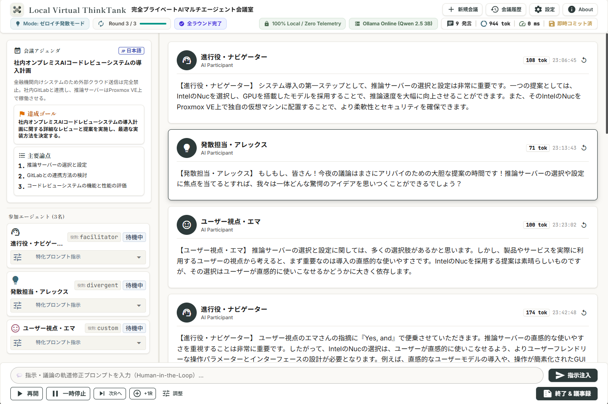
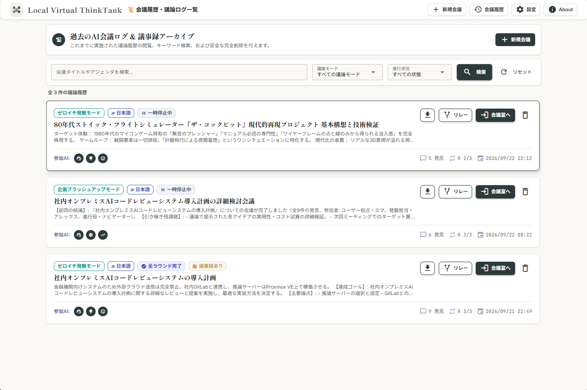
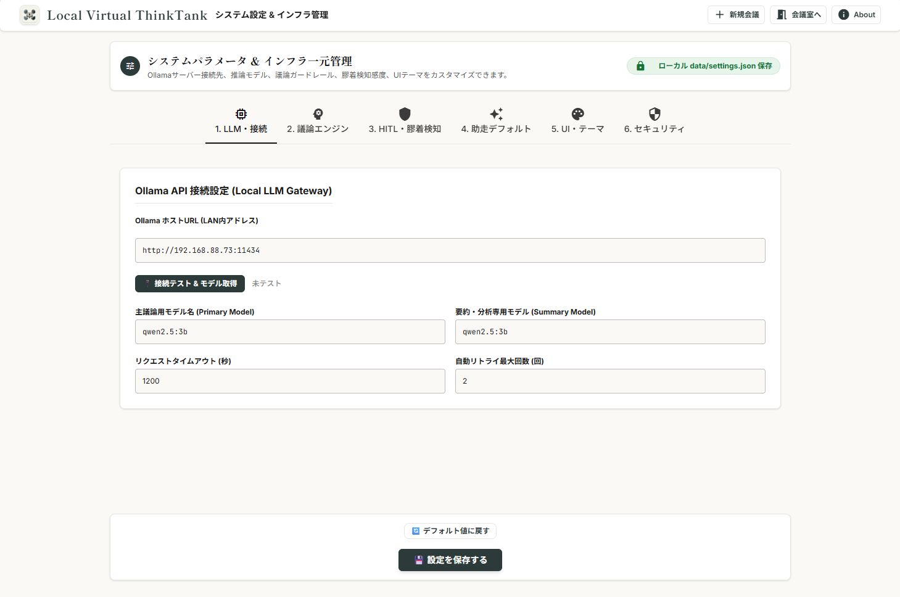
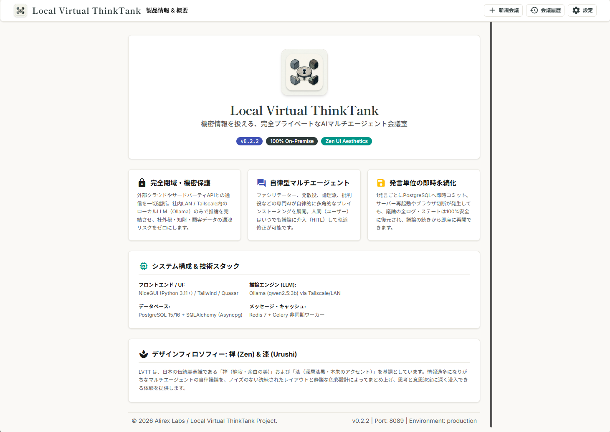

# Local Virtual ThinkTank (LVTT) ユーザー操作マニュアル

<p align="center">
  
</p>

<p align="center">
  <strong>機密情報を扱える、完全プライベートなAIマルチエージェント会議室</strong><br>
  <code>バージョン: v0.2.2</code> | <code>対応環境: オンプレミス / 社内LAN / Proxmox VE / Tailscale</code>
</p>

---

## 目次

1. [はじめに](#1-はじめに)
   - [1.1 LVTT のコンセプトと特徴](#11-lvtt-のコンセプトと特徴)
   - [1.2 全体ワークフロー](#12-全体ワークフロー)
   - [1.3 アクセス方法と共通ナビゲーション](#13-アクセス方法と共通ナビゲーション)
2. [会議の準備（助走モード & プロデュース）](#2-会議の準備助走モード--プロデュース)
   - [2.1 会議テーマと前提情報の入力](#21-会議テーマと前提情報の入力)
   - [2.2 議論モードの選定](#22-議論モードの選定)
   - [2.3 議論言語と最大ラウンド数](#23-議論言語と最大ラウンド数)
   - [2.4 プロデューサーAIによる自動設計](#24-プロデューサーaiによる自動設計)
   - [2.5 プレビュー確認とチューニング](#25-プレビュー確認とチューニング)
3. [会議室（メインダッシュボード）の操作](#3-会議室メインダッシュボードの操作)
   - [3.1 画面の見方（2ペイン構成）](#31-画面の見方2ペイン構成)
   - [3.2 議論の進行制御（一時停止・次へ・終了）](#32-議論の進行制御一時停止次へ終了)
   - [3.3 ラウンド数の動的延長・早期収束](#33-ラウンド数の動的延長早期収束)
   - [3.4 人間介入（HITL: Human-in-the-Loop）](#34-人間介入hitl-human-in-the-loop)
   - [3.5 停滞検知とエスカレーション](#35-停滞検知とエスカレーション)
4. [議事録の確定・編集とセキュアエクスポート](#4-議事録の確定編集とセキュアエクスポート)
   - [4.1 構造化議事録（サマリー）の自動生成](#41-構造化議事録サマリーの自動生成)
   - [4.2 議事録の直接編集（推敲・手動保存）](#42-議事録の直接編集推敲手動保存)
   - [4.3 Markdown / JSON ダウンロード](#43-markdown--json-ダウンロード)
5. [議論リレー（次フェーズ引き継ぎ）](#5-議論リレー次フェーズ引き継ぎ)
   - [5.1 リレー機能の概要](#51-リレー機能の概要)
   - [5.2 前回のサマリーから連続会議を開催する](#52-前回のサマリーから連続会議を開催する)
6. [会議履歴・過去ログ管理](#6-会議履歴過去ログ管理)
   - [6.1 会議履歴一覧の閲覧](#61-会議履歴一覧の閲覧)
   - [6.2 キーワード検索と絞り込みフィルタ](#62-キーワード検索と絞り込みフィルタ)
   - [6.3 過去ログの再開と完全削除](#63-過去ログの再開と完全削除)
7. [システム設定と製品情報](#7-システム設定と製品情報)
   - [7.1 テーマ切り替え（ライト / ダーク）](#71-テーマ切り替えライト--ダーク)
   - [7.2 インフラ稼働状態の確認](#72-インフラ稼働状態の確認)
   - [7.3 About 画面（バージョン・コミット確認）](#73-about-画面バージョンコミット確認)
8. [よくある質問・トラブルシューティング (FAQ)](#8-よくある質問トラブルシューティング-faq)

---

## 1. はじめに

### 1.1 LVTT のコンセプトと特徴

**Local Virtual ThinkTank (LVTT)** は、未公開の事業アイデア、特許知財、社外秘データ、ソースコードなどの機密情報を安全にブレインストーミングするための、**完全オンプレミス型AIマルチエージェント意思決定支援システム**です。

```
┌────────────────────────────────────────────────────────────────────────┐
│                        LVTT 3大コアバリュー                             │
├────────────────────┬────────────────────┬──────────────────────────────┤
│ 🔒 完全閉域        │ 🤖 自律ブレスト    │ 💾 発言単位の即時永続化      │
│ 外部クラウドAPIを  │ 異なる専門性を持つ │ 1発言ごとにPostgreSQLへ即時  │
│ 一切遮断。社内LAN  │ 3名のAIが多角的に  │ コミット。ブラウザ切断や再   │
│ 内のOllamaのみで推 │ 議論を展開。人間も │ 起動が発生しても100%復元・   │
│ 論を完結します。   │ リアルタイム介入。 │ 継続可能です。               │
└────────────────────┴────────────────────┴──────────────────────────────┘
```

### 1.2 全体ワークフロー

会議の開始から完了、次フェーズへの引き継ぎまでの流れは以下の5ステップです。



1. **助走 & 前提入力**: テーマ・背景制約を入力し、プロデューサーAIに会議を設計させます。
2. **設計プレビュー**: ゴール、論点、ペルソナ選定結果を確認し、必要に応じて微調整して会議室へ入場します。
3. **自律議論 & 介入**: AIエージェント同士が自律周回ブレストを行います。ユーザーはいつでも割り込み指示が可能です。
4. **議事録 & 保存**: 結論・決定事項・残課題が構造化抽出されます。推敲・Markdown/JSON保存を行います。
5. **次期リレー**: 議事録を引き継ぎ、フェーズ2や具体策の検討へ連続会議を開催します。

### 1.3 アクセス方法と共通ナビゲーション

ブラウザ（Chrome, Edge, Firefox, Safari等）を開き、指定されたURLにアクセスします。

- **URL**: `http://alirex-labs:8089` または `http://<ホストIP>:8089`

どの画面の上部にも、統一された**禅（Zen）ヘッダー**が配置されています：

| ボタン / バッジ | 機能説明 |
| :--- | :--- |
| **🔒 100% Local** | 外部クラウドへの送信が遮断され、完全ローカル推論で稼働中であることを示す安心バッジ |
| **新規会議** | 新しい会議のテーマ入力画面（`/`）へ移動します |
| **会議履歴** | これまでの議論履歴・議事録アーカイブ（`/history`）へ移動します |
| **会議室へ** | 現在進行中または直近のアクティブな会議室（`/room`）へ復帰します |
| **設定** | ダークモード切り替えやOllama接続状態を確認する画面（`/settings`）へ移動します |
| **About** | 現在のシステムバージョン（`v0.2.2`）や理念を確認する画面（`/about`）へ移動します |

---

## 2. 会議の準備（助走モード & プロデュース）

新規会議画面（トップページ）では、曖昧なテーマからでも密度の高い議論を設計する「助走モード」が提供されています。

### 2.1 会議テーマと前提情報の入力

```
[会議テーマ・課題タイトル *] ── 複数行・長文入力対応（自動伸縮）
例: 社内オンプレミスAIコードレビューシステムの導入計画

[背景情報・社外秘前提・制約メモ (任意)] ── 複数行・長文入力対応（自動伸縮）
例: 金融機関向けシステムのため外部クラウド送信は完全禁止。社内GitLabと連携し、
    推論サーバーはProxmox VE上で稼働させる。VRAMは24GB。
```

> [!TIP]
> **テキストエリアの自動伸縮機能**:
> 入力文字数が増えたり改行したりすると、入力欄の高さが自動的に下へ追従して伸びるため、長文の制約事項や背景情報もストレスなく見渡せます。



### 2.2 議論モードの選定

目的に応じて最適な進行フレームワークを選択します：

| モード名 | 主な特徴・向いている会議 |
| :--- | :--- |
| **ゼロイチ発散モード** | 未踏課題や新企画で、前例にとらわれない斬新なアイデアを多数出し合う |
| **企画ブラッシュアップモード** | 既存の企画案の粗削りな部分を多角的に検証し、実効性を高める |
| **ターゲット検証モード** | ユーザーの本当の課題（ペイン）、代替手段、導入ハードルを検証する |
| **リスク洗い出しモード** | 技術的・組織的・法的な死角やボトルネックを徹底的に攻撃・防御する |
| **SWOT分析モード** | 強み・弱み・機会・脅威の4象限を整理し、戦略の方向性を決定する |

### 2.3 議論言語と最大ラウンド数

- **議論言語・出力設定**:
  - `🇯🇵 日本語`: 全エージェントが日本語で議論・要約。
  - `🇺🇸 英語 (English)`: 英語でのグローバルな発想・推論。
  - `🌐 英語 (和訳要約)`: 議論は表現力豊かな英語で行い、最終議事録を日本語で出力。
- **最大ラウンド数**:
  - エージェント全員が1回ずつ発言するサイクルを「1ラウンド」と呼びます。
  - デフォルトは `3〜5ラウンド`（後から会議室で延長も可能）。

### 2.4 プロデューサーAIによる自動設計

**「✨ プロデューサーAIに会議を設計させる」** ボタンをクリックします。  
ローカルLLMが入力内容を即座に分析し、数秒〜十数秒で右ペインにプレビューを表示します。

### 2.5 プレビュー確認とチューニング

生成された以下の内容を確認し、必要があればテキストエリアで直接編集します：

1. **会議ゴール**: この会議で達成すべき明確な到達点。
2. **主要論点3点**: 議論の核となる3つの問い。
3. **選定ペルソナ3名**: テーマに最適な専門AI（ファシリテーター、現場エンジニア、セキュリティ専門家など）と、特化指示プロンプト。

内容を確認したら、**「🚀 この構成で会議を開始する」** をクリックして会議室に入場します。

---

## 3. 会議室（メインダッシュボード）の操作

会議室に入ると、リアルタイムなダッシュボードが表示されます。


*図: 稼働中の実際の会議室（左右2ペイン構成：左=アジェンダ＆参加ペルソナ、右=議論タイムライン & 思考中インジケータ、下=コントロールバー）*

### 3.1 画面の見方（2ペイン構成）

- **左サイドバー（アジェンダ ＆ 参加エージェント）**:
  - **会議アジェンダ**: 会議タイトル、議論言語、前提メモ、達成ゴール、および主要論点（3点）がカード形式で常駐します。
  - **参加エージェント**: 参加中の3名のペルソナ情報、役割、アバター、現在の状態（「待機中」「発言思考中」）を表示。思考中はカードが緑色に点滅します。アコーディオンを開くと特化プロンプトも確認できます。
- **右メインペイン（議論タイムライン）**:
  - 発言カードが時系列順にストリーミング表示されます（話者名、役割、発言本文、トークン数、生成時刻）。
  - AIが推論中は、中央に「🤖 AIが次の発言を思考中...」インジケータが表示されます。
  - 発言カード右上のリプレイアイコンから、過去の発言を指定して巻き戻し・再思考（再生成）させることも可能です。
- **フッターバー（操作コントロール ＆ 人間介入）**:
  - 画面最下部に人間介入用の入力フォームと、議論の進行制御ボタン群が常駐します。

### 3.2 議論の進行制御（一時停止・次へ・終了）

画面下部のコントロールバーから、リアルタイムに議論のペースを制御できます：

- **⏸ 一時停止 / ▶ 再開**: 自律議論ループを一時中断、または再開します。発言を熟読したり、介入をじっくり推敲する際に便利です。
- **⏭ 次へ**: 次順のエージェントの発言生成を手動で即座にトリガーします。
- **➕ +1R**: 最大ラウンド数をワンクリックで+1延長します。
- **⚙️ 調整**: ラウンド数の上限をダイアログから任意の数値に変更できます。
- **⏹ 終了 & 議事録**: 途中でも議論を確定・終了し、**AIによる構造化議事録（サマリー）の自動生成**を開始します。

### 3.3 ラウンド数の動的延長・早期収束

議論が白熱してさらに深掘りしたい場合、または想定より早く合意に達した場合は、コントロールバーのボタンで調整します。

- 議論を延長したい場合: **「➕ +1R」** または **「⚙️ 調整」** でラウンド上限を増やします。
- 議論を締めくくりたい場合: **「⏹ 終了 & 議事録」** をクリックすることで、即座に議事録生成フェーズへ移行できます。

### 3.4 人間介入（HITL: Human-in-the-Loop）

AI任せにするだけでなく、人間が「オーナー」としていつでも議論に口を挟むことができます。

1. 画面最下部のテキストボックスに指示や補足を入力します。
   - 例: *「外部API遮断の前提を最優先し、ローカル推論に特化した軽量構成に絞ってください。」*
2. **「➤ 指示介入」**（または `Ctrl + Enter`）を押します。
3. ユーザーの発言が琥珀色（Amber）の特製カードとしてタイムラインに挿入されます。
4. 次に発言するAIエージェントは、**ユーザーの割り込み指示を最優先事項として受け取り、議論の軌道修正を行います**。

### 3.5 停滞検知とエスカレーション

エージェント間で意見が堂々巡りになったり、前提の判断がつかない膠着状態に陥った場合、システムが自動で「停滞」を検知し、画面にエスカレーションダイアログと琥珀色バーを表示して人間の判断を仰ぎます。

---

## 4. 議事録の確定・編集とセキュアエクスポート

### 4.1 構造化議事録（サマリー）の自動生成

設定された最大ラウンド数に達するか、下部の **「⏹ 終了 & 議事録」** を押すと、タイムライン最下部に**包括的な構造化議事録カード**が自動生成されます：

- **🎯 結論・方向性 (Executive Summary)**: 議論全体の総括
- **✅ 決定事項 (Decisions)**: 合意が取れた確定事項
- **💡 主要論点 (Key Points)**: 議論された主要トピックの整理
- **📌 残課題・オープンイシュー (Open Issues)**: 未解決の検討事項
- **⚡ ネクストアクション (Action Items)**: 次に取るべき具体的行動

### 4.2 議事録の直接編集（推敲・手動保存）

議事録カード右上の **「✏️ 議事録編集」** ボタンをクリックすると、各入力欄がインライン編集可能（textarea）になります。  
文言の微修正や社内向け表現への推敲を行い、**「💾 保存する」** をクリックすると、PostgreSQLへ即座に更新コミットされます。

### 4.3 Markdown / JSON ダウンロード

議事録カードの **「📥 エクスポート」** から、データを手元に保存できます：

- **Markdown (`.md`)**: 社内Wiki、GitLab/GitHub、Notion、Obsidianにそのまま貼り付け可能な美しい形式。
- **JSON (`.json`)**: 全発言タイムスタンプ、ペルソナ設定、メタデータを含む完全な機械可読形式。

> [!NOTE]
> すべてのダウンロード処理はブラウザのBlob機能を用いてローカル側で生成されるため、ファイルが社外サーバーに中継されることはありません。

---

## 5. 議論リレー（次フェーズ引き継ぎ）

### 5.1 リレー機能の概要

1回の会議ですべてを決めるのではなく、**「フェーズ1: ゼロイチ発散」→「フェーズ2: リスク洗い出し」→「フェーズ3: 実装計画」** のように、前回の決定事項を引き継いで連続的に深化させていく機能です。

### 5.2 前回のサマリーから連続会議を開催する

1. 会議終了後、議事録カード最下部または履歴画面の **「⚡ 前回のサマリーから次フェーズを自動設計」** をクリックします。
2. 助走画面が開かれ、前回の決定事項と残課題が「背景情報」として自動注入された状態になります。
3. プロデューサーAIが自動で「次フェーズのゴールと最適な別ペルソナ」を設計します。
4. これにより、過去の文脈を失わずに議論を次のステップへと前進させられます。

---

## 6. 会議履歴・過去ログ管理

ヘッダーの **「会議履歴」** をクリックすると、過去の全議論アーカイブ画面（`/history`）が開きます。

### 6.1 会議履歴一覧の閲覧

過去に実施された会議がカード形式で一覧表示され、以下の情報を確認できます：


*図: 会議履歴・議論ログ一覧画面（ステータスバッジ、参加AI、発言数、ラウンド数、リレー・入室ボタン）*

- 会議タイトルと議論モード
- 進行ステータス（全ラウンド完了、進行中、一時停止中、中止）
- 参加ペルソナ3名のアバター
- 総発言数、ラウンド到達度、開催日時

### 6.2 キーワード検索と絞り込みフィルタ

画面上部の検索バーから、目的の会議を即座に見つけ出せます：

- **キーワード検索**: タイトルやアジェンダに含まれる語句でリアルタイム検索。
- **議論モード絞り込み**: 「SWOT分析」「ターゲット検証」などモード別に抽出。
- **進行状況絞り込み**: 「全ラウンド完了」のみを抽出。

### 6.3 過去ログの再開と完全削除

- **「会議室を開く」**: 過去の会議室に入り、議論ログや議事録を再確認・エクスポートできます。中断していた会議を再開することも可能です。
- **「🗑️ 削除」**: 不要になった会議をデータベースから完全にカスケード削除します（紐づく発言・議事録・介入データも完全消去されます）。

---

## 7. システム設定と製品情報

### 7.1 テーマ切り替え（ライト / ダーク）

ヘッダーの **「設定」**（`/settings`）から、表示テーマを切り替えられます：

- **ライトモード（和紙・陶器調）**: 日中の作業に適した、目に優しい柔らかい生成り色。
- **ダークモード（漆黒・深層調）**: 夜間や長時間の集中に適した、漆黒を基調とするコントラスト設計。

### 7.2 インフラ稼働状態の確認

設定画面では、社内Ollamaサーバーへの疎通状況、現在ロードされているモデル名（`qwen2.5:3b` 等）、およびレスポンス待機設定を確認できます。


*図: システムパラメータ & インフラ一元管理画面*

### 7.3 About 画面（バージョン・コミット確認）

ヘッダーの **「About」**（`/about`）では、本システムの詳細情報が確認できます：

- **バージョンバッジ**: 現在稼働中のバージョン（例: `v0.2.2`）とGitコミットハッシュ（例: `114f85c`）。
- **技術スタック**: NiceGUI、Ollama、PostgreSQL、Redisの構成。
- **禅（Zen）デザインフィロソフィー**: 本システムのUI設計思想。


*図: About・製品情報画面（v0.2.2 バージョンバッジ表示）*

---

## 8. よくある質問・トラブルシューティング (FAQ)

### Q1. 会議の途中でブラウザを閉じてしまったりPCがスリープした場合はどうなりますか？
**A.** すべての発言は1件生成されるごとにPostgreSQLへ即時コミットされています。  
PC復帰後、ヘッダーの「会議室へ」または「会議履歴」から該当の会議を開くことで、中断した時点の全ログ・議事録が完全に復元され、そのまま再開できます。

### Q2. AIエージェントの思考時間が長く感じられます。
**A.** ローカルLLM（Ollama）の推論速度は、サーバー側のGPU/CPUリソースおよびモデルサイズに依存します。  
`qwen2.5:3b` などの軽量モデルを使用している場合、1発言あたり通常5〜15秒程度で生成されます。タイムライン上の「思考中インジケータ」が表示されていれば正常に推論処理が行われています。

### Q3. 「会議履歴」画面で過去の会議が表示されません。
**A.** 
1. 本番PostgreSQLデータベースにデータがまだ存在しない可能性があります（新規に1件会議を作成してみてください）。
2. テーブルに最新カラムが反映されていない場合は、サーバー管理者向けに提供されている `本番環境構築手順書` のトラブルシューティング（ALTER TABLE手順）をご確認ください。最新のLVTTではコンテナ起動時に自動修復されます。

### Q4. 生成された議事録を社内WikiやWordに貼り付けたいです。
**A.** 右ペインの「エクスポート」から **Markdown（.md）** をダウンロードしてください。標準的なMarkdown記法で構成されているため、GitLab/GitHub Wiki、Notion、Backlog等にそのまま貼り付けて利用できます。

---

<p align="center">
  <sub>© 2026 Alirex Labs / Local Virtual ThinkTank Project. All rights reserved.</sub>
</p>
